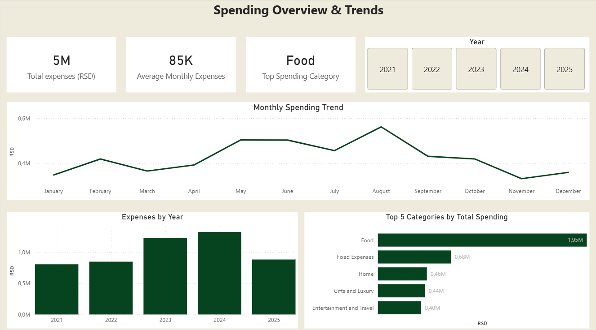
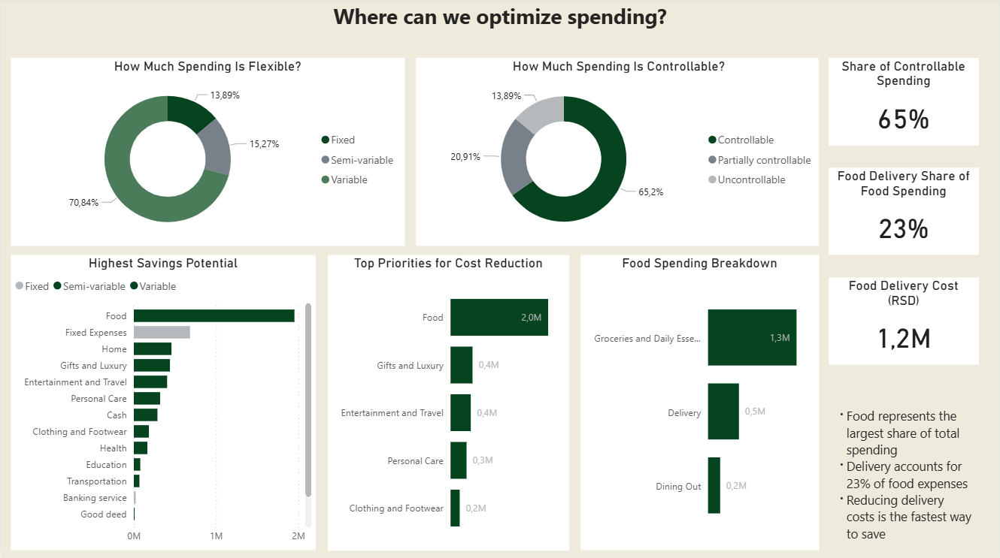
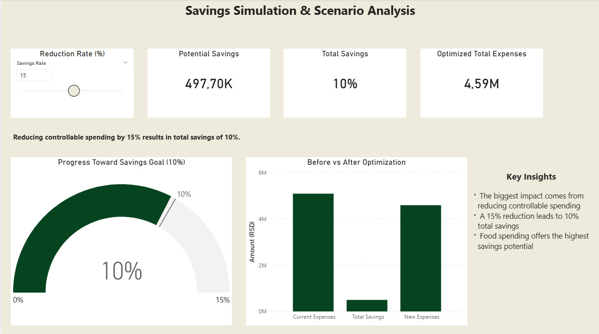
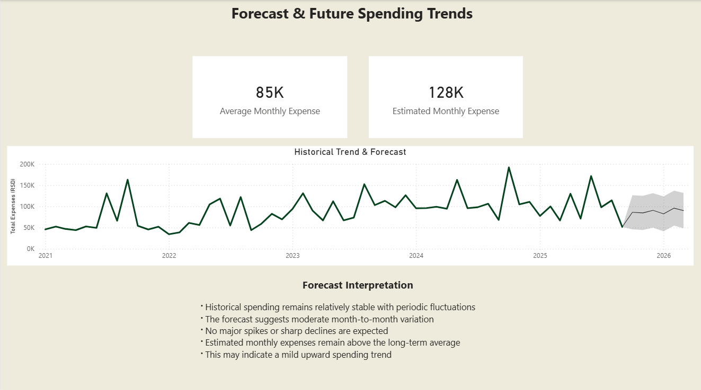

# Household Expense Analysis (Power BI)

This is a Power BI project based on household spending data from 2021 to 2025.

The goal of the report was to organize expenses, identify the largest cost categories, explore savings opportunities, and create a simple forecast based on past spending patterns.

## Project Contents

The report has four pages:

### 1. Expenses Overview
General summary of total expenses, average monthly spending, yearly comparison, and top categories.

### 2. Cost Analysis & Optimization Potential
Comparison of flexible and controllable expenses, with focus on areas where costs can be reduced.

### 3. Savings Simulation
What-if analysis showing how reducing controllable expenses affects total spending.

### 4. Forecast & Future Trends
Monthly trend analysis with Power BI forecast for future expenses.

## Tools Used

- Power BI
- Power Query
- DAX
- Data modeling
- Forecasting

## Main Findings

- Food is the largest expense category
- A large share of costs can be controlled or adjusted
- Delivery costs have noticeable impact on food spending
- Reducing controllable costs can lead to meaningful savings

## Notes

This project was created as part of my Data Analytics learning portfolio.
